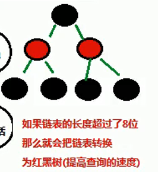

# QG训练营移动组第一周周记：2019年3月31日

## 一周总结

这一周持续在进行java的基础学习，并试图进行多线程的学习

## 存在问题

学习速度不够快，进度略慢。

## 下周规划

早点学完进程，继续安卓的学习

## 笔记

**hashCode()相同，值却不一定相同？？？**

"重地"

"通话"


 **不同的字符串可能会有相同的HashCode吗？**

​	可能。hashcode是用来判断两个字符串是否相等的依据,不同的字符串不可能有相同的hashcode,但不同的	hashCode经过与长度的取余（？），就很可能产生相同的hashCode,就是所谓的哈希冲突.

​	**所以hashcode相同，字符串不一定相同**


**相同的字符串可能会有不同的HashCode吗？**

​	不可能，根据一定的算法，获得的哈希值是固定的，除非人为强行修改hashcode()方法。


**那么在Set中是如何判断重复元素的呢？**

​	往Set中添加元素时，首先先调用hashcode()判断哈希值，如果哈希值相同，那么再调用equals()方法判断值。

​	也就是如果**哈希值**不同的话的，那么就直接判断其为不同的元素。也就不再调用**equals()**方法。

​	所以如果要用Set来存储对象的时候，**若要重写equals()方法，一定要连同hashcode()方法一起重写**。HashMap的key也是等同。


**ArrayList**底层使用**数组**实现，所以**查找特别快**。为了实现其动态改变大小的目的，每一次增删都会新建一个新的数组的旧数组的值传进去，增删涉及操作较多，所以**增删比较慢**。

**LinkedList**底层使用**链表**实现，所以他的特性和ArrayList相反，**增删快，查找慢**。

如果涉及的数据需要频繁修改的话，使用LinkedList更有利于提高系统效率。


**HashSet**集合的数据结构：              哈希表的特点：**速度快**

​	数组 + 链表   或者   数组 + 红黑树


首先先计算元素的哈希值，相同哈希值的元素以链表的形式作为一组，不同哈希值的链表分别存放到不同的数组结构里。（数组初始容量为16）

如果同一哈希值的元素超过了8个，那么会以红黑树的形式分成一组



提高查询速度。


------


### **HashMap**

##### 方法	

​	

```java
public V put(K key,V value)
```

传入一对映射，若原本没有重复的key，则返回null，若原本有重复的key，则返回对应的旧的value

```java
public V remove(Object key)
```

删除一对映射，通过参数key删除，若查无key则返回null，若删除成功则返回已删除key对应的value

```java
public V get(Object key)
```

返回传入的key对应的value

```java
public boolean containsKey(Object key)
```

判断表内有无传入的key，有则返回true，无则返回false

```java
public boolean containsValue(Object value)
```

判断表内有无传入的value，有则返回true，无则返回false

```java
public static interface Map.Entry<K,V>
```

映射项 ( 键-值对 )  ,是Map接口中一个内部接口Entry，用来记录 键-值 之间的关系。

```java
public Set< Map.Entry<K,V> > entrySet()
```

把该HashMap对象中的所有 Map.Entry<K,V>取出来放入一个Set中并返回。

而Map.Entry<K,V>拥有getKey()和getValue()方法，可以用来遍历HashMap，对应代码实现如下：

```JAVA
HashMap<Integer, String> hm = new HashMap<>();
hm.put(150,"play01");
hm.put(123,"play02");
hm.put(185,"play03");
hm.put(115,"play04");
for (Map.Entry<Integer, String> entry : hm.entrySet()) {
    System.out.println(entry.getKey()+"---"+entry.getValue());
}
```

结果如下：

​	115---play04
​	150---play01
​	185---play03
​	123---play02

------

#### JDK9 新特性

##### of静态工厂方法

​	List，Map，Set的静态工厂方法of可以一次性给集合添加多个元素。

注意：

​	1、of方法只适用于List，Map，Set 3个接口，并不适用于其实现类 (ArrayList、HashMap等) 

​	2、of的返回值是一个不能改变的集合，集合不能再使用add,put方法添加元素，会抛出异常。

​	3、Set接口和Map接口在调用of方法时，不能有重复的元素，否则会抛出异常。

​	如下是代码实现：

```java
Set<Integer> set =  Set.of(1,2,3);
List<Integer> list = List.of(1,2,1);
Map<String ,Integer> map = Map.of("a",1,"b",2);
```

​	如下是错误示范：

```java
Set<Integer> set =  Set.of(1,2,3,1); 				//抛IllegalArgumentException异常
List<Integer> list = List.of(1,2,1);
Map<String ,Integer> map = Map.of("a",1,"b",2,"a",3);//抛IllegalArgumentException异常
set.add(1);										//抛UnsupportedOperationException异常
```

------

# 线程

### 首先是一个简单的双线程打印

Main.java

```java
public class Main {
    public static void main(String[] args) {
        MyThread myThread = new MyThread();
        myThread.start();//调用start方法开启新线程，并执行里面的run方法
        for(int i = 0; i<20 ; i++) System.out.println("main "+i);
    }
}
```

MyThread.java

```java
public class MyThread extends Thread{
    @Override
    public void run() {
        for(int i = 0; i < 20 ;i++) System.out.println("run "+i);
    }
}
```

这里开辟了main线程和myThread线程，两条线程相互争夺cpu的资源，谁抢到了就其代码。

其打印结果为:(随机打印)：

​	main 0
​	run 0
​	main 1
​	run 1
​	main 2
​	run 2

下面是多线程的内存空间：


------

### Thread类

#### **获取当前线程的名称：**

```
String getName()
```

 返回该线程的名称。

```
static Thread currentThread()
```

 返回当前正在执行的线程对象的引用。

下列是代码的实现：

```java
public class MyThread extends Thread{
    @Override
    public void run() {
        System.out.println(Thread.currentThread());
    }
}
```


#### 设置线程的名称：

```java
void setName(String name)
```

​	改变线程的名称为name。以下是代码：可以从自身的run里调用

```java
public class MyThread extends Thread{
    @Override
    public void run() {
        setName("aa");
        System.out.println(Thread.currentThread().getName());
    }
}
```

​	或者从其他线程调用

```java
public class Main {
    public static void main(String[] args) {
        MyThread myThread = new MyThread();
        myThread.setName("bb");
        myThread.start();
    }
}
```

改变线程也可以通过构造方法，如以下代码：

```java
public class MyThread extends Thread{
    public MyThread(String name) {
        super(name);
    }
    @Override
    public void run() {
        System.out.println(Thread.currentThread().getName());
    }
}
```

然后再main中设置名字并运行：

```java
public class Main {
    public static void main(String[] args) {
        new MyThread("aa").start();
    }
}
```

------

#### Thread类的常用方法sleep：

```java
public static void sleep(long millis);
```

使**当前正在执行**的线程以指定毫秒数暂停，毫秒数结束后，线程继续执行。

( sleep方法会抛出InterruptedException异常 ) 如下是模拟秒表：

```
public class Main {
    public static void main(String[] args) throws InterruptedException {
        for(int i = 0; i <= 60; i++){
            System.out.println(i);
            Thread.sleep(1000);
        }
    }
}
```

------

#### 通过Runnable接口创建多线程：

​	利用Thread类的构造方法

```java
Thread(Runnable target) //分配新的Thread对象
Thread(Runnable target, String name)//分配新的Thread对象    
```

创建一个Runnable接口的实现类并重写Runnable接口的Run方法，用该类去创建一个对象并作为Thread类的构造参数创建Thread类对象，此时调用该Thread类的start方法可创建多线程，代码实现如下：

RunnableImpl.java

```java
public class RunnableImpl implements Runnable{
    @Override
    public void run() {
        for(int i = 0 ; i < 20 ;i++)
        System.out.println("Runnable "+i);
    }
}
```

Main.java

```java
public class Main {
    public static void main(String[] args){
        new Thread(new RunnableImpl()).start();
        for(int i = 0 ; i < 20 ;i++)
            System.out.println("Main "+i);
    }
}
```

即可实现双线程打印。